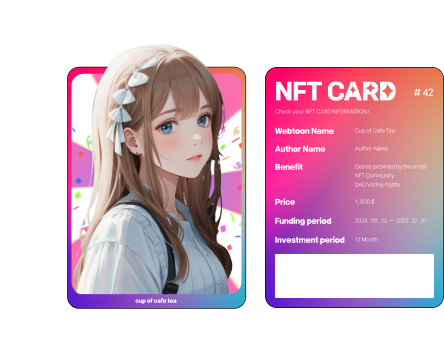

# Moonlyt 🌙

  

## NFT Platform for Webtoon Enthusiasts and Creators

The 'Moonlyt' project is a novel platform designed for webtoon enthusiasts and creators with unique flair. We are revolutionizing the way webtoon content is created, shared, and monetized.

## 📚 Documentation
For more detailed information, please visit our [Docs](https://docs.moonlyt.net)

## 🖼️ Demo Site
Experience Moonlyt in action: [Moonlyt Demo](https://moonlyt.vercel.app/)

## 📈 Pitch Deck 
Explore Moonlyt's vision, strategy, and potential: [See Our Pitch Deck](https://drive.google.com/file/d/15tt9npzX3p5mO14GQKy56WopRtaZhY4I/view?usp=drive_link)

## 💰 Tokenomics
### Revenue Redistribution Mechanism 💸
Revenues generated from the works are used to purchase MYLT tokens, which are then fairly distributed among NFT-holding investors and authors.

### Token Scarcity and Value Appreciation 📈
The total quantity of tokens is limited, ensuring their scarcity. As revenue increases, the value of the tokens has the potential to rise.

### Opportunities for Reinvestment and Sustained Interest 💵
This system offers attractive reinvestment opportunities for investors and fosters continued interest in the authors' creations.

### A New Model for Revenue Sharing 🤝
Directly benefiting creators and investors from the commercial success of the works, presenting a new model of revenue sharing in the webtoon industry.

### Promoting Sustainable Growth 🌱
Enhancing the creative drive of authors and offering valuable investment opportunities for investors, thereby fostering sustainable growth in the webtoon industry.